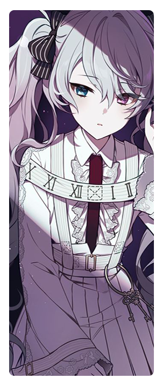

# 

 
 

 

✩ ᵕ̈ ིྀ yuzuru •˙ ? ⌗ ⊱ 
⋅˚₊‧ ୨୧ ‧₊˚ ⋅ 21 years old ⋅˚₊‧ ୨୧ ‧₊˚ ⋅ 
⋅˚₊‧ ୨୧ ‧₊˚ ⋅ Hobby Developer ⋅˚₊‧ ୨୧ ‧₊˚ ⋅ 
⋅˚₊‧ ୨୧ ‧₊˚ ⋅ From Germany ⋅˚₊‧ ୨୧ ‧₊˚ ⋅ 
⋅˚₊‧ ୨୧ ‧₊˚ ⋅ Girls Love & Romance addicted (Anime/Manga)⋅˚₊‧ ୨୧ ‧₊˚ ⋅ 
⋅˚₊‧ ୨୧ ‧₊˚ ⋅ Using **TypeScript**, **JavaScript** ⋅˚₊‧ ୨୧ ‧₊˚ ⋅ 
⋅˚₊‧ ୨୧ ‧₊˚ ⋅ Familiar with: Windows, Linux (Debian, Kali) ⋅˚₊‧ ୨୧ ‧₊˚ ⋅ 
⋅˚₊‧ ୨୧ ‧₊˚ ⋅ Understand: German (Native), English (Good) ⋅˚₊‧ ୨୧ ‧₊˚ ⋅ 

 
 

 
 
- [**yamaiYuzuru/yamaiYuzuru**](https://github.com/yamaiYuzuru/yamaiYuzuru) 
Just this readme lol.
- [**yamaiYuzuru/cosmicpal**](https://github.com/yamaiYuzuru/cosmicpal) 
my multipurpose discord bot (under development, 5% ready...)
 

All rights of the images goes to their respective owner 
Thanks to [Misono Mika](https://github.com/misonomikadev) for the inspiration. 
 thank you for reading. wanna join my discord (german)? [Crystal Spirits](https://discord.gg/crystalspirits).
